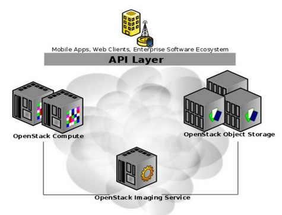
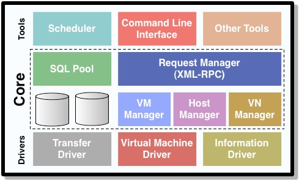
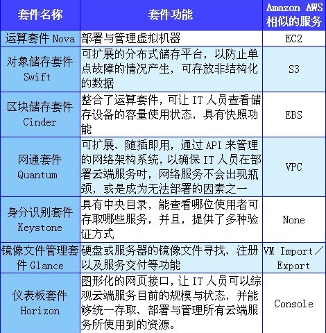
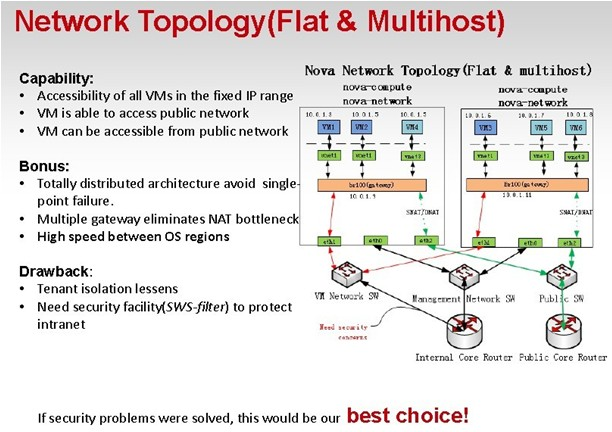
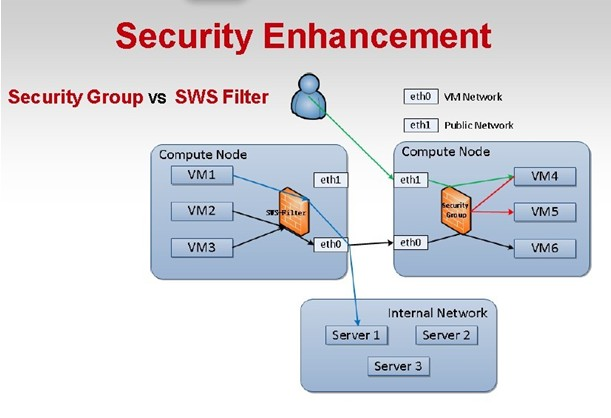
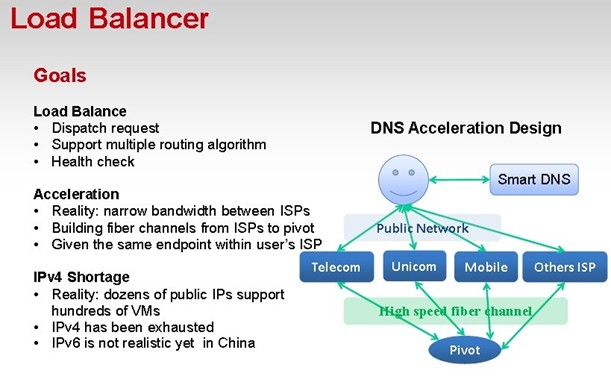

# OpenStack vs OpenNebula #

####OpenSource008： 
&emsp;&emsp;&emsp;&emsp;&emsp;&emsp;&emsp;&emsp;&emsp;&emsp;丁林斌 HarrisonDing

&emsp;&emsp;&emsp;&emsp;&emsp;&emsp;&emsp;&emsp;&emsp;&emsp;韦润酥 Thinkfly

&emsp;&emsp;&emsp;&emsp;&emsp;&emsp;&emsp;&emsp;&emsp;&emsp;王加兵 wangjiabing

&emsp;&emsp;&emsp;&emsp;&emsp;&emsp;&emsp;&emsp;&emsp;&emsp;刘志安 james-liuzhian

## 项目介绍 ##
####OpenStack 介绍####

&emsp;&emsp;OpenStack 是由 Rackspace 和 NASA 共同开发的云计算平台,旨在为公共及私有云的建设与管理提供软件的开源项目，它的首要任务是简化云的部署并为其带来良好的可扩展性。 该项目以Apache许可证授权，并且是一个自由软件和开放源代码项目。 目前它的社区拥有超过130家企业及1350位开发者，这些机构与个人都将OpenStack作为基础设施即服务（简称IaaS）资源的通用前端。

&emsp;&emsp;OpenStack由几个主要的组件组合起来完成一些具体的工作，包括OpenStack Compute (Nova)， OpenStack Object Storage (Swift)和OpenStack Image Service (Glance). 关系如下图，

&emsp;&emsp;部件及关系如下说明，

&emsp;&emsp;OpenStack Compute，为云组织的控制器，它提供一个工具来部署云，包括运行实例、管理网络以及控制用户和其他项目对云的访问(thecloudthroughusersandprojects)。它底层的开源项目名称是Nova，其提供的软件能控制IaaS云计算平台，类似于AmazonEC2和RackspaceCloudServers。实际上它定义的是，与运行在主机操作系统上潜在的虚拟化机制交互的驱动，暴露基于WebAPI的功能。

&emsp;&emsp;OpenStack Object Storage，是一个可扩展的对象存储系统。对象存储支持多种应用，比如复制和存档数据，图像或视频服务，存储次级静态数据，开发数据存储整合的新应用，存储容量难以估计的数据，为Web应用创建基于云的弹性存储。

&emsp;&emsp;OpenStackImageService，是一个虚拟机镜像的存储、查询和检索系统，服务包括的RESTfulAPI允许用户通过HTTP请求查询VM镜像元数据，以及检索实际的镜像。VM镜像有四种配置方式：简单的文件系统，类似OpenStackObjectStorage的对象存储系统，直接用Amazon'sSimpleStorageSolution(S3)存储，用带有ObjectStore的S3间接访问S3。

####OpenNebula 介绍####
&emsp;&emsp;OpenNebula是一个用于管理各种各样分布式数据中心基础设施的云计算工具包， 是一个自由软件和开发源代码的软件，以Apache v2许可授权。 可以用来构建私有云，公有云和混合云，并提供独特的云管理特性，并且还保持与构建内部云需要的其他IT厂商集成兼容性。 工具包包含集成，管理，可扩展性，安全性和会计的功能，并以一种标准化，互操作性和便携性的特色，提供用户和管理员多种可选择的云接口。根据分配策略，结合数据中心资源和远程的云资源， 在虚拟基础设施上以虚拟机形式精心编排存储，网络，虚拟化，监测和安全技术部署多级服务。 

&emsp;&emsp;OpenNebula由C12G赞助， 已被主机供应商，电信运营商，IT 服务提供商，超级计算中心，研究实验室和国际研究项目使用， 其他一些云解决方案使用OpenNebula作为云引擎或内核服务。

&emsp;&emsp;OpenNebula的构架包括三个部分： 驱动层、核心层、工具层，架构如下图，
 

&emsp;&emsp;驱动层直接与操作系统打交道，负责虚拟机的创建、启动和关闭，为虚拟机分配存储，监控物理机和虚拟机的运行状况。  

&emsp;&emsp;核心层负责对虚拟机、存储设备、虚拟网络等进行管理。  

&emsp;&emsp;工具层通过命令行界面/浏览器界面方式提供用户交互接口，通过API方式提供程序调用接口。

## 功能比较 ##
####OpenStack####
&emsp;&emsp;云操作系统OpenStack是由好几个不同的功能套件所构成的开源云软件，目前共有7个功能不同的套件，分别是运算套件Nova、对象储存套件Swift、区块储存套件Cinder、网通套件Quantum、身分识别套件Keystone、镜像文件管理套件Glance、提供管理接口的仪表板套件Horizon。就云服务的架构来看，其中又以运算套件、网通套件以及储存套件最为重要。

&emsp;&emsp;企业若是想要使用OpenStack打造云端服务，并非每个套件都必须使用，企业可挑选现阶段没有的管理套件即可，像是全球第8大的在线零售商MercadoLibre使用了运算套件Nova、对象储存套件Swift、镜像文件管理套件Glance，来打造自家PaaS私有云。

&emsp;&emsp;OpenStack每个版本都有不同的名称。在2010年10月，OpenStack第一版诞生，名为Austin，而在这个版本，仅有运算套件Nova与对象储存套件Swift。
随着OpenStack发展，各领域厂商加入，不同的套件推陈出新，陆续被加入在新的版本内。目前最新版名为Grizzly，就包含了上述的7个套件，并还有2个套件刚刚开发完成，分别是Orchestration层整合套件Heat，以及数据监控套件Ceilometer。

1、运算套件Nova

&emsp;&emsp;Nova套件主要提供部署与管理虚拟机器的功能。工程师可利用API开发云端应用程序，而IT管理人员则可透过网页式的接口查看或管理硬件资源运作的状况，并可重起、暂停、调整，甚至直接关闭虚拟机器。

&emsp;&emsp;IT人员可将Nova套件部署在多家厂商的虚拟化平台上，目前来说，以KVM和Xen虚拟化平台最为稳定。除了支持不同的虚拟化平台之外，在硬件架构的部份，OpenStack支持x86架构、ARM架构等。另外，Nova套件还支持Linux轻量级的虚拟化技术LXC，能够再切割虚拟机器，分出更多的虚拟化执行环境。  

&emsp;&emsp;此外，Nova套件还具有管理LAN网络的功能，可程序化的分配IP地址与VLAN，快速部署网络与资安功能。Nova套件还可将某几台虚拟机器设为群组，和不同群组作隔离，并有基于角色的访问控制（RBAC）功能，可根据使用者的角色确保可存取的资源为何。

2、对象储存套件Swift

&emsp;&emsp;Swift套件提供可扩展的分布式储存平台，以防止单点故障的情况产生。使用者可透过API进行存取，可存放非结构化的数据，像是图像、网页、网志等，并可作为应用程序数据备份、归档以及保留之用。

&emsp;&emsp;透过Swift套件，可让业界标准的设备存放PB等级的数据量。而且，当新增服务器后，储存群集可轻易的横向扩充。

&emsp;&emsp;此外，因为Swift套件是透过软件的逻辑，确保数据被复制与分布在不同设备上，这可让企业使用较便宜的设备，节省成本。

3、区块储存套件Cinder

&emsp;&emsp;Cinder套件允许区块储存设备能够整合商业化的企业储存平台，像是NetApp、Nexenta、SolidFire等。区块储存系统可让IT人员设置服务器和区块储存设备的各项指令，包括建立、连接和分离等，并整合了运算套件，可让IT人员查看储存设备的容量使用状态。

&emsp;&emsp;Cinder套件并提供快照管理功能，可保护虚拟机器上的数据，作为系统回复时所用，快照甚至可用来建立一个新的区块储存容量。

4、网通套件Quantum

&emsp;&emsp;Quantum套件是个可扩展、随插即用，透过API来管理的网络架构系统，确保IT人员在部署云端服务时，网络服务不会出现瓶颈，或是成为无法部署的因素之一。

&emsp;&emsp;Quantum套件支持众多网通厂商的技术，IT人员可配置IP地址，分配静态IP或是动态IP。而且，IT人员可使用SDN技术，像是OpenFlow协议来打造更大规模或是多租户的网络环境。

&emsp;&emsp;此外，允许部署和管理其它网络服务，像是入侵侦测系统（IDS）、负载平衡、防火墙、VPN等。

5、身分识别套件Keystone

&emsp;&emsp;Keystone套件作为OpenStack的身分认证系统，具有中央目录，能查看哪位使用者可存取哪些服务，并且，提供了多种验证方式，包括使用者账号密码、Token（令牌）以及类似AWS的登入机制。另外，Keystone可以整合现有的中央控管系统，像是LDAP。

6、镜像文件管理套件Glance

&emsp;&emsp;Glance套件提供提供硬盘或服务器的镜像文件寻找、注册以及服务交付等功能。储存的镜像文件可作为新服务器部署所需的范本，加快服务上线速度。若是有多台服务器需要配置新服务，就不需要额外花费时间单独设置，也可做为备份时所用。

7、仪表板套件Horizon

&emsp;&emsp;Horizon套件提供IT人员一个图形化的网页接口，让IT人员可以综观云端服务目前的规模与状态，并且，能够统一存取、部署与管理所有云端服务所使用到的资源。

&emsp;&emsp;Horizon套件是个可扩展的网页式App。所以，Horizon套件可以整合第3方的服务或是产品，像是计费、监控或是额外的管理工具。

8、业务流程平台Heat

&emsp;&emsp;这是一套，旨在帮助用户更轻松地配置以OpenStack为基础的云体系。利用Heat应用程序，开发人员能够在程序中使用模板以实现资源的自动化部署。根据项目管理者的说法，Heat能够启动应用、创建虚拟机并自动处理整个流程。它还拥有出色的跨平台兼容性，能够与Amazon Web Services业务流程平台CloudFormation相对接——这意味着用户完全可以将AWS模板引入OpenStack环境当中。

9、收集使用数据的服务Ceilometer

&emsp;&emsp;这是一项专门从OpenStack云环境中收集使用数据的服务。它集成了OpenStack的验证与身份管理系统，从而实现更为细化的数据追踪效果，其中包括哪位用户正在使用哪些资源、具体使用时长是多少等。为了满足服务供应商的需要，它还提供自动计费功能。

####OpenNebula####

&emsp;&emsp;ONE 不同以存的 VM Manager，在于高模块化和开放的架构去符合 cluster 管理者的需求，最新版可支持 XEN 和 KVM，还有以下特色和功能：

&emsp;&emsp;&emsp;&emsp;1、有效的资源管理

&emsp;&emsp;&emsp;&emsp;2、强大的接口 (提供 API 和 CLI 来监控或控制 VMs 和实体机器)

&emsp;&emsp;&emsp;&emsp;3、第三方的软件整合

&emsp;&emsp;&emsp;&emsp;4、开放和弹性的架构

&emsp;&emsp;&emsp;&emsp;5、容错机制

&emsp;&emsp;&emsp;&emsp;6、印象檔的管理

&emsp;&emsp;&emsp;&emsp;7、网络管理

&emsp;&emsp;&emsp;&emsp;8、稳定和可扩称性

&emsp;&emsp;&emsp;&emsp;9、根据服务工作量的需求 scale

&emsp;&emsp;&emsp;&emsp;10、简单的安装和管理

&emsp;&emsp;&emsp;&emsp;11、开放原始码

#####4.0新特性#####

&emsp;&emsp;一、OpenNebula Core：

&emsp;&emsp;1. VM System Snapshots

&emsp;&emsp;虚拟机系统快照是指整个virtual machine的全状态的快照，即memory+disk的快照，这个features目前仅支持KVM和VMWare

&emsp;&emsp;2. Disk Snapshots

&emsp;&emsp;磁盘快照的改进，与OpenNebula 3.8相比，4.0支持在线的磁盘快照（live snapshot of disk），注意：需要应用程序来保证文件系统数据的一直性

&emsp;&emsp;3. capacity re-sizing

&emsp;&emsp;重新虚拟机资源配置的能力，比如调整virtual machine的cpu和memory等资源的配置，注意：此调整只能在离线的情况下进行

&emsp;&emsp;4. programmable VM operations

&emsp;&emsp;可编程的virtual machine operations，比如可以指定在周五16:00关闭某个virtual machine，然后在下周一9:00启动此virtual machine

&emsp;&emsp;5. NIC hotplugging

&emsp;&emsp;支持网卡的热插拔，动态的增加virtual machine的网卡设备

&emsp;&emsp;6. IPv6 supporting

&emsp;&emsp;7. Plain file datastore

&emsp;&emsp;增加支持常规文件的datastore，增加一种特殊类型的datastore用来存储kernel，ramdisk以及其他文件，将来在生成virtual machine的context时使用，另外，还增加了响应的访问控制的功能

&emsp;&emsp;8. user defined VM tags

&emsp;&emsp;9. Powerful CLI

&emsp;&emsp;二、OpenNebula Administrator Interface：

&emsp;&emsp;1. syslog support

&emsp;&emsp;增加系统日志的功能，用来记录oned进程和scheduler进程的日志信息

&emsp;&emsp;2. ACLs for Cluster

&emsp;&emsp;对cluster的更细粒度的访问控制功能

&emsp;&emsp;3. Default Quotas     

&emsp;&emsp;默认的配额管理功能，用来限制各种虚拟资源的使用

&emsp;&emsp;4. Efficient Monitoring

&emsp;&emsp;更有效的监控管理，大大的降低了监控的延迟和由监控带来的性能开销

&emsp;&emsp;5. VM Cancellation and clean-up synchronization

&emsp;&emsp;虚拟机取消和销毁操作的同步bug的解决，之前版本中，虚拟机的cancel and destroy operation操作是asynchronous，现在变成同步的，destroy operation必须等待cancel operation完成

&emsp;&emsp;6. 高并发的网络驱动

&emsp;&emsp;消除了在同一个host上创建多个vm时，网络是瓶颈的问题，即优化了网络驱动，可以高并发的在同一个host上创建多个vm。

&emsp;&emsp;三、OpenNebula Drivers

&emsp;&emsp;1. Authentication Drivers

&emsp;&emsp;更好的认证管理的驱动

&emsp;&emsp;2. Virtualization Drivers

&emsp;&emsp;&emsp;&emsp;（1）更好的支持Xen 3 and Xen 4，原生的支持，不再需要通过适配器（adapter）支持

&emsp;&emsp;&emsp;&emsp;（2）对KVM增加了一些新的特性，比如disk cache和DISK IO相关的属性

&emsp;&emsp;&emsp;&emsp;（3）Custom attributes for VMware VMX files

&emsp;&emsp;3. Storage Drivers

&emsp;&emsp;&emsp;&emsp;（1）优化了iscsi driver，提高了tgt server的并发性

&emsp;&emsp;&emsp;&emsp;（2）增加了cephdatastore

&emsp;&emsp;4. Scheduler

&emsp;&emsp;&emsp;&emsp;（1）Cluster attributes for VM placement，增加了虚拟机分配时的集群属性，可以在调度算法的requirements和rank中增加cluster和host相关的属性，可以更方便的标记属于一个cluster的所有主机

&emsp;&emsp;&emsp;&emsp;（2）Affinity Policies，亲和策略，增加一个特殊的变量CURRENT_VMS，用来指定将要调度的虚拟机分配到与CURRENT_VMS指定的虚拟机有关系的host上，比如CURRENT_VMS=5，即将要调度的虚拟机调度到运行有虚拟机5的host上，CURRENT_VMS！=5，即没有运行虚拟机5的hosts上

&emsp;&emsp;&emsp;&emsp;（3）Any host attribute for scheduling expressions

&emsp;&emsp;&emsp;&emsp;（4）Scheduler feedback through VM tags

&emsp;&emsp;调度反馈信息，如果被tag的某个vm调度失败了，会反馈失败信息。

##OpenStack、OpenNebula社区活跃度比较

&emsp;&emsp;通过论坛和邮件列表的数据源和Git数据源的原始数据对OpenStack和OpenNebula项目过去12个月的社区活跃度进行分析和比较。
###官方论坛和邮件列表数据源分析
####主题数和帖子数
&emsp;&emsp;两个项目每个月所产生的讨论主题数和帖子数，在过去12个月中，OpenStack的主题数和帖子数约为1200和 3300，OpenNebula的主题数和帖子数约为150和 400；OpenStack和OpenNebula相关的讨论数量不在同一水平上； 与OpenStack相关的讨论数量远大于与OpenNebula相关的讨论数量。
####社区参与度
&emsp;&emsp;平均意义上的“讨论帖子数/讨论主题数”则反映了一个社区的参与程度，称之为参与度（Participation Ratio）。在过去12个月中OpenStack项目的参与度相对较高，接近于3；OpenNebula项目的参与度相对较低，略高于2。整体上OpenStack项目的参与度一直高于OpenNebula。
####参与论坛或者邮件列表讨论的总人数
&emsp;&emsp;两个项目每个月参与论坛或者邮件列表讨论的总人数，OpenStack的活跃用户数量为800，OpenNebula项目的活跃用户数量为80。OpenStack的活跃用户数量要远大于OpenNebula。在过去六个月中， OpenStack项目的活跃用户数量都有不同程度的攀升，OpenNebula项目的活跃用户数量变化不大。
####社区人口数
&emsp;&emsp;这两个项目的社区人口数，OpenStack项目的社区人口为3800，而OpenNebula项目的社区人口为1200，相对较低。
####新增加社区人口数
&emsp;&emsp;这两个项目每个月新增加的社区人口数量，OpenStack为280人，OpenNebula为50人。在过去三个月中， OpenStack的社区人口增长速度较快，与之相比OpenNebula的社区人口增长较为缓慢。
####活跃人口数
&emsp;&emsp;OpenStack和OpenNebula两个项目进行对比，OpenStack的社区人口比OpenNebula要多；在过去一个季度和一个月份中，OpenStack的活跃人口都是最多，分别为1600和800， OpenNebula分别为150和100。
####项目的粘性
&emsp;&emsp;OpenStack与OpenNebula这两个项目的新增人口占当月活跃用户的30%左右，基本相当，如果不考虑社区人口的规模的话，可以认为OpenStack与OpenNebula项目的粘性相当。
####社区活跃度指数
&emsp;&emsp; “社区活跃度指数”这个参数是以上几个参数的组合, 社区活跃度指数最高的项目，是最活跃的项目。目前OpenStack项目的“社区活跃度指数”最高（以明显的优势领先）为7.97，而OpenNebula为1.4。
###Git数据源分析
####提交（commit）操作的次数
&emsp;&emsp;两个项目每个月进行提交（commit）操作的次数的对比,总体来看，OpenStack项目提交代码的频率较高。在过去12个月中，这个项目每个月进行提交操作的次数维持在600上下。OpenNebula项目提交代码的频率较低，平均每个月提交代码200次左右。
####提交代码的人数
&emsp;&emsp;两个项目每个月提交代码的人数的对比。总体来看，OpenStack项目提交代码的人数远远超过其他项目，并且一直保持迅猛增长的势头。OpenNebula项目提交代码的人数相对较少，并且在过去12个月当中基本上没有增长。
####贡献机构
&emsp;&emsp;人们通常通过代码贡献者所使用的电子邮件地址来识别其所在的机构。每个月向这两个项目提交代码（commit操作）的邮件地址所属域名数量.总体来看，OpenStack项目提交代码的域名数量远远超过其他项目，并且一直保持迅猛增长的势头。OpenNebula项目提交代码的域名数量相对较少，并且在过去12个月当中基本上没有增长。
&emsp;&emsp;从OpenStack和OpenNebula这两个项目贡献代码次数最多的机构看， OpenNebula属于以单一机构（opennebula.org）为主导的开源项目，而OpenStack属于由多家机构共同合作的开源项目。对于OpenStack项目来说，来自IBM的贡献占了14%，来自RedHat的贡献占了12%，来自Mirantis的贡献占了9%，来自HP的贡献占了5%。
###结果
&emsp;&emsp;从以上的两种数据源和多个指标进行对比后可以看出，OpenStack社区的活跃度远大于OpenNebula社区的活跃度。

## 实际应用 ##
####OpenStack开源云技术在新浪的应用####

&emsp;&emsp;OpenStack是一个开源的云操作系统，是由网络主机服务商Rackspace和美国宇航局联合推出的一个云计算项目，目的是制定一套开源软件标准，让用户自己搭建灵活的云计算环境。

&emsp;&emsp;OpenStack目前已发展成为基于OpenStack软件本身展开的自由软件和开放源代码项目，获得业界的广泛支持。

&emsp;&emsp;2012年4月18日，新浪云计算宣布正式加入全球开源云计算项目Openstack，将选择OpenStack作为IaaS平台解决方案。

&emsp;&emsp;新浪研发部总经理符庆明表示，新浪云计算之所以选择OpenStack有这样几个理由：

&emsp;&emsp;首先，OpenStack是完全用Python编写的唯一开源的IaaS项目，与C/C++或Java为基础的项目比较，Python项目意味着更容易安装，修改，封装和调试。

&emsp;&emsp;第二，因为它是开源的，在部署或升级过程中有错误发生时，通过阅读源代码，我们就可以迅速找到原因，并修复它。

&emsp;&emsp;第三，由于有Rackspace的参与，OpenStack实际上是由主机托管/服务提供商行业设计的，因此它非常适用于公有云的大服务器、多租户的工作负载。另外，OpenStack成熟的功能性、hypervisor无关性设计及其可扩展特性等，都让我们非常欣赏。

&emsp;&emsp;新浪云计算在对OpenStack平台之中相对较为弱势的网络功能组件Quantum以及负载均衡功能组件等均做了再次开发，大大减少了OpenStack在这方面的不足。

新浪对OpenStack Quantum功能组件改进拓扑图

新浪对OpenStack安全方面的改进，增加了上图中左边部分的防火墙

&emsp;&emsp;新浪对OpenStack平台负载均衡方面的改进，通过建立一个Pivot系统增加了对教育网、移动网络以及其他ISP的支持。

&emsp;&emsp;新浪云计算加入OpenStack，作为OpenStack中国的积极推动者，这在很大程度上将推动OpenStack云开源代码项目的发展；成为参与这一全球最大的开源云计算服务研发项目的企业与机构之中领先的IaaS平台研发与业务运营的积极实践者，其贡献与意义将不言而喻。

&emsp;&emsp;加入OpenStack，也将为新浪云计算提供更多与全球企业或研发机构交流、合作的机会与渠道，向全球分享中国云计算技术的步伐将更加稳健。这也将极大的鼓舞国内广大云技术研发和使用者，未来以OpenStack为代表的开源云端软件在中国将更加普及，国内更多企业将从中受益。

#### OpenNebula开源云技术在中国移动的应用 ####

&emsp;&emsp;OpenNebula是由欧洲研究学会发起的虚拟基础设备和云端运算的计划。该项目在2005年启动，2008年年初发布首个开放源代码版本。OpenNebula1.0 ~ 4.0，历经十几个稳定的发行版，已经非常成熟；OpenNebula则拥有温和、优雅的欧洲基因。它的支持厂商和用户主要在欧洲，其在中国拥有两个重量级的用户。中国移动研究院的“大云”和中国科学院的“凌云”项目均基于OpenNebula开源框架构建。

&emsp;&emsp;中国移动研究院从2007年开始进行云计算的研究和开发，是最早介入云计算研发和实践的企业之一。2012年（第六届）移动互联网国际研讨会(IMIC)上中国移动隆重发布了自主研发的云计算软件平台--中国移动"大云"。“大云”是中国移动研究院集成并扩展了多个云计算相关的开源软件和自主研发的部分功能组件的产品，在大云中主要采用了 Hadoop 分布式计算软件和 OpenNebula 弹性计算管理系统，虚拟机使用的是 Xen。研发期间，中国移动与Opennebula讨论项目的功能需求和发展方向，并在Opennebula社区开博介绍大云基于Opennebula平台构建公众服务云的经验，并计划以patch形式贡献BC-EC针对Opennebula的功能进行的改进和优化。

&emsp;&emsp;凌云（LingCloud）是中国科学院计算技术研究所分布式与云计算研究团队研发的一套云计算系统软件。它旨在解决云计算系统中异构负载支持、多租户资源租赁、系统高效整合等问题。

&emsp;&emsp;凌云系统目前已经在国内若干家科研单位生产性使用。为促进中国云计算产业的发展，加强学术界与产业界的交流，研究团队决定将系统逐步开源。凌云首个开源版本已于 2011 年 5 月正式上线，以 Apache License 2.0 授权发布，是国内首款开源的 Iaas 云计算系统。系统主体采用 SOA 架构，使用 Java 技术路线实现；虚拟化实现基于 Xen 平台，并使用 OpenNebula 管理虚拟机群。未来版本还将继续开放其他特色鲜明的功能模块。

## 组员贡献 ##

丁林斌： 项目介绍

韦润酥： 功能比较

王加兵： 实际应用

刘志安： 社区活跃度比较

## 参考资料 ##

References:

1. http://baike.baidu.com/view/4924215.htm
2. http://en.wikipedia.org/wiki/OpenStack
3. http://openstack.csdn.net/content.html?arcid=2808843
4. http://en.wikipedia.org/wiki/OpenNebula
5. http://opennebula.org/documentation:archives:rel2.0:architecture
6. http://www.qyjohn.net/?p=1263
7. http://www.csdn.net/article/2013-07-04/2816105-OpenStack-OpenNebula-Eucalyptus-CloudStack
8. http://www.qyjohn.net/?p=3297
